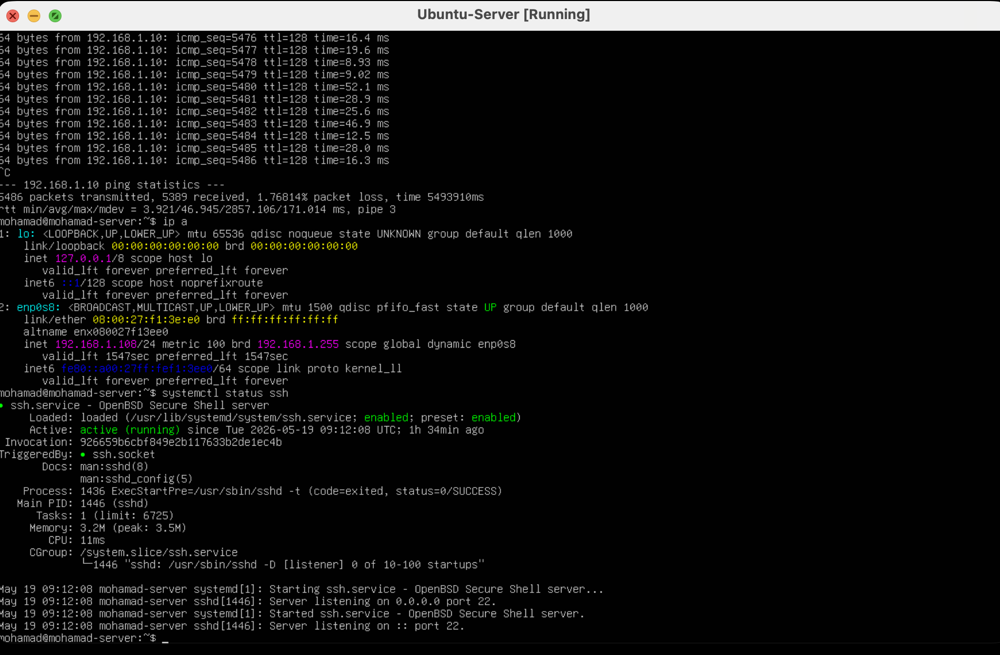
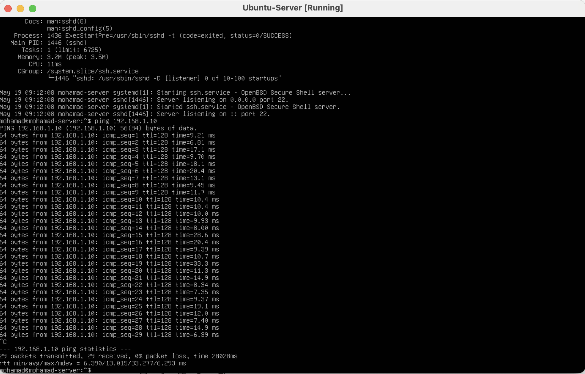
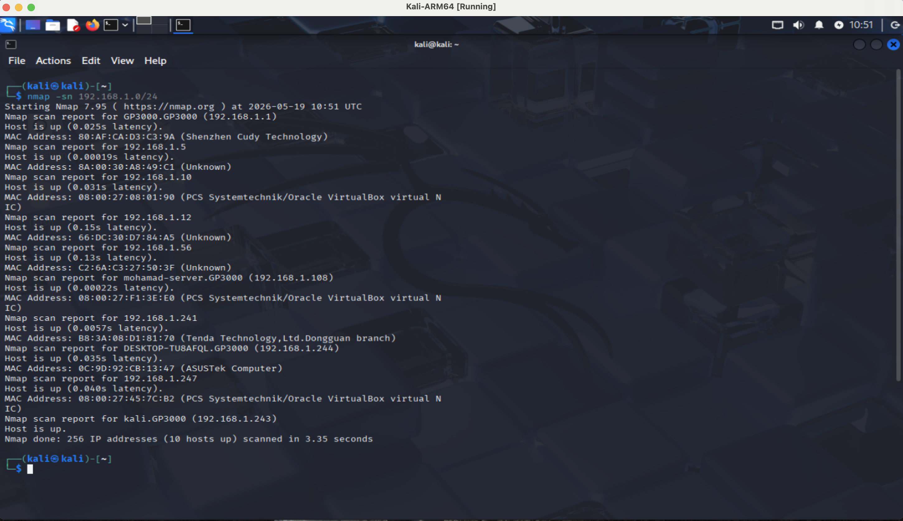

# Enterprise Homelab Infrastructure

## Overview

This project is a multi-VM enterprise homelab built for hands-on system administration, networking, and infrastructure practice.

The environment includes:
- Windows Server 2022 Domain Controller
- Active Directory Domain Services (AD DS)
- DNS Server
- Windows 10 domain-joined client
- Ubuntu Server with SSH enabled
- Kali Linux for network scanning and testing
- Bridged networking between all virtual machines

The goal of this lab was to simulate a real enterprise environment and practice infrastructure management, authentication, networking, troubleshooting, and Linux/Windows interoperability.

---

# Infrastructure Architecture

| Machine | Role | IP Address |
|---|---|---|
| DC01 | Domain Controller + DNS | 192.168.1.10 |
| CLIENT101 | Domain-Joined Windows Client | DHCP |
| Ubuntu Server | Linux Server + SSH | 192.168.1.108 |
| Kali Linux | Network Scanning / Testing | DHCP |

---

# Technologies Used

- Windows Server 2022
- Active Directory
- DNS
- Windows 10 Pro
- Ubuntu Server
- Kali Linux
- VirtualBox
- UTM
- SSH
- Nmap
- ICMP / Ping
- Bridged Networking

---

# Skills Demonstrated

- Active Directory configuration
- Domain Controller deployment
- DNS configuration and testing
- Domain user management
- Windows client domain joining
- Linux server administration
- SSH configuration
- VM networking
- Bridged adapter configuration
- Firewall troubleshooting
- Network connectivity testing
- Host discovery using Nmap
- Infrastructure troubleshooting

---

# Screenshots

## Active Directory Server

## Active Directory Users and Computers

## DNS Resolution Test

## Domain-Joined Windows Client

## Domain Login

## Ubuntu SSH Server

## Ubuntu to Domain Controller Ping Test

## Kali Linux Network Discovery Scan

---

# Networking

All virtual machines were configured using bridged networking in VirtualBox so they could communicate on the same subnet.

Network testing included:
- ICMP ping validation
- DNS resolution testing
- SSH service testing
- Nmap host discovery scans

---

# Troubleshooting Performed

During the lab setup, several infrastructure and networking issues were identified and resolved, including:

- DNS resolution failures
- Domain Controller discovery issues
- Windows Firewall restrictions
- VM networking configuration problems
- NAT vs Bridged Adapter configuration
- SSH service configuration on Ubuntu
- Client-to-domain connectivity troubleshooting

---

# What I Learned

This project provided hands-on experience with:
- enterprise infrastructure concepts
- Active Directory administration
- domain authentication
- Linux and Windows interoperability
- network troubleshooting
- infrastructure documentation
- cybersecurity-oriented networking tools

---

# Future Improvements

Planned future additions:
- Group Policy configuration
- Remote Desktop administration
- SIEM integration
- Centralized logging
- VPN setup
- VLAN segmentation
- Windows Server hardening
- Monitoring and alerting tools
